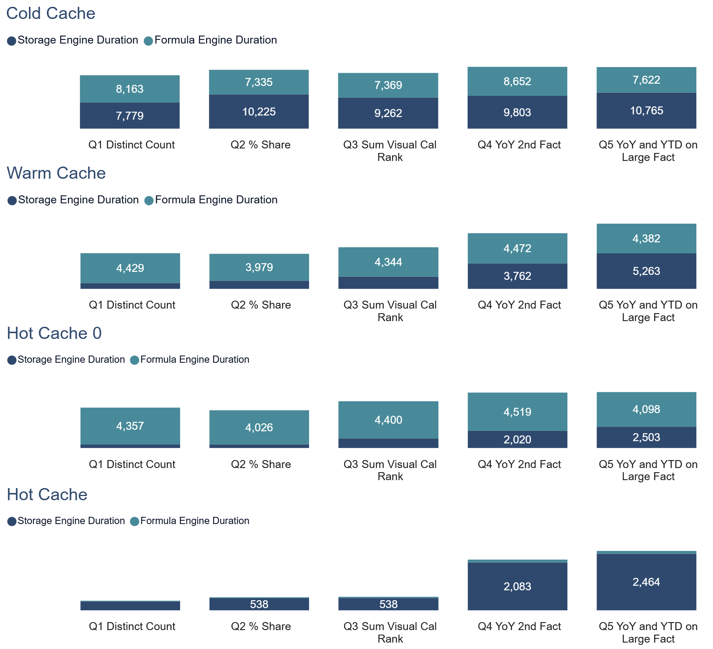
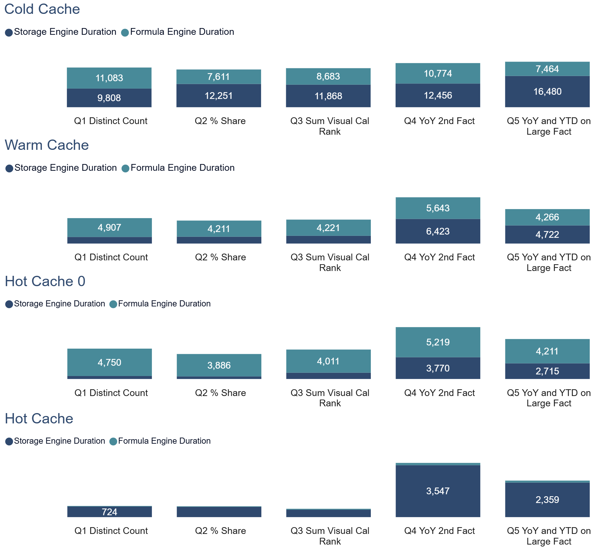
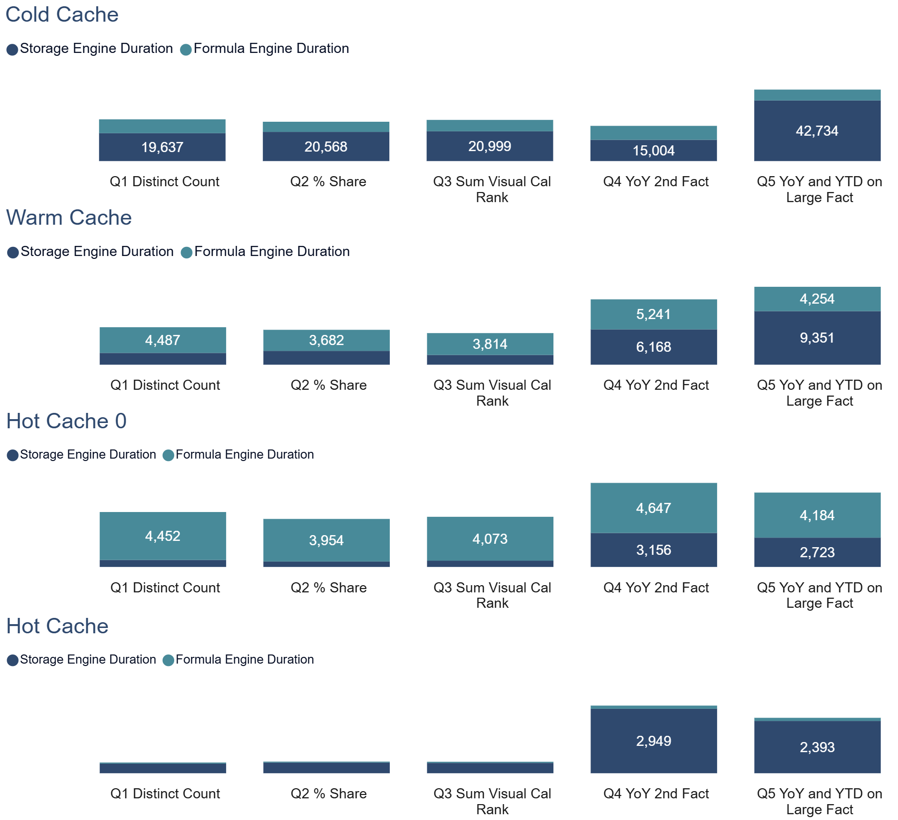
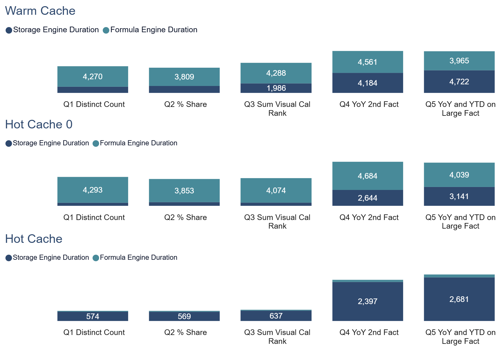
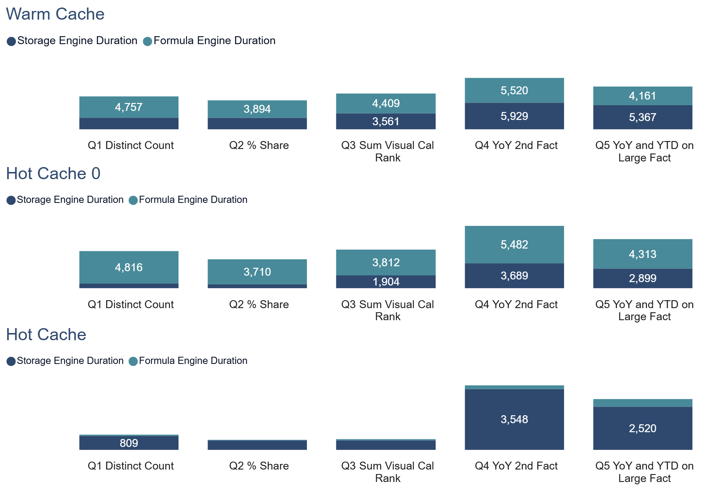
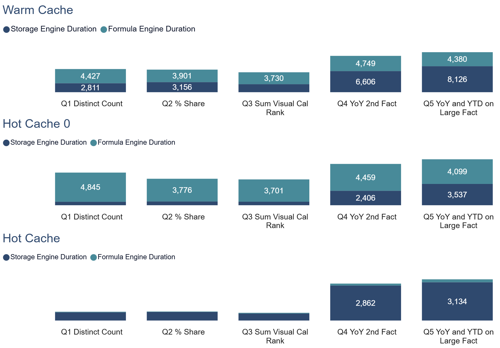
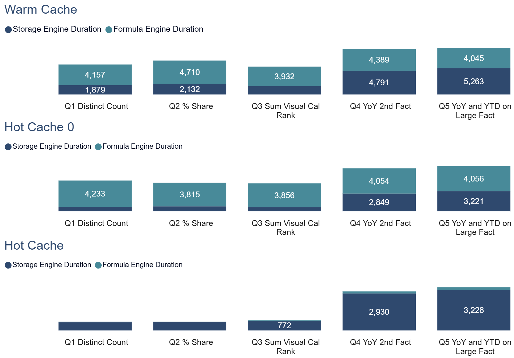
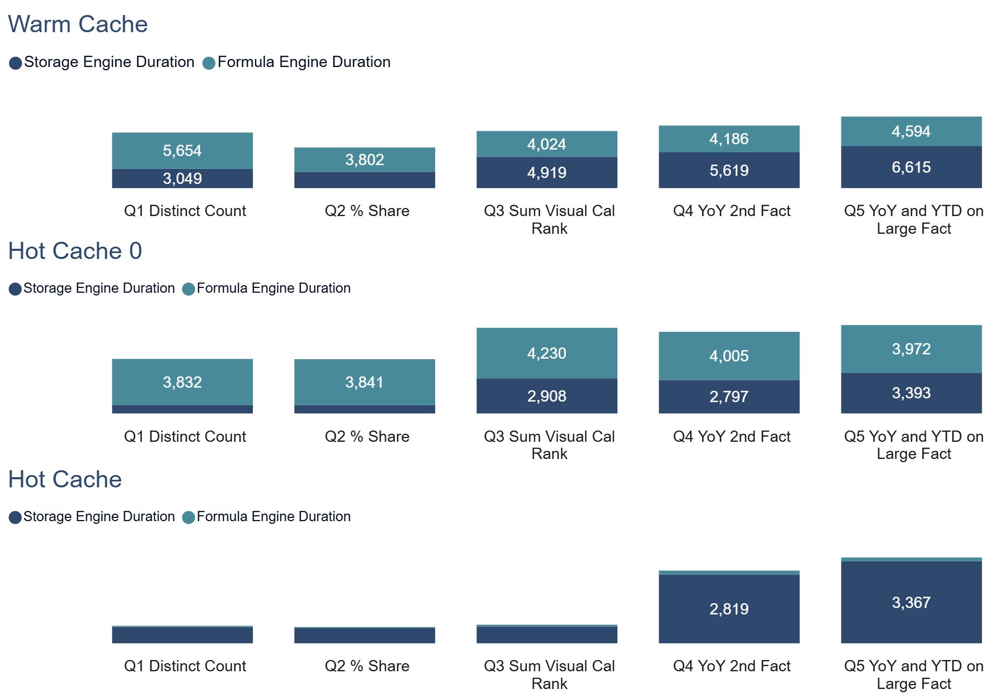
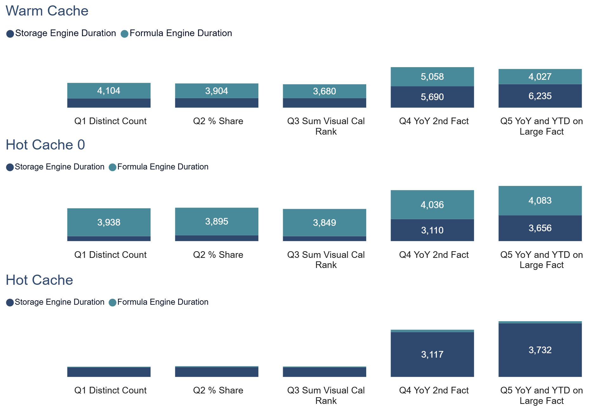

# Direct Query Formula Engine Duration vs Storage Engine Duration
## Scenario 1 No filter is applied
### Scale Factor 10

### Scale Factor 100

### Scale Factor 1000

## Scenario 2 Aggregation filter are applied
### Scale Factor 10

### Scale Factor 100

### Scale Factor 1000

## Scenario 3 All filter are applied
### Scale Factor 10

### Scale Factor 100

### Scale Factor 1000
